# DeepDive - マルチエージェント型AI調査エージェント

質問を入力すると、3つのAIエージェントが順にWeb検索と要約を行い、引用付きのMarkdown調査レポートを自動生成するアプリ。ChatGPTやGeminiの「Deep Research」が裏で何をしているかを、自分で実装して理解するために作った個人開発プロジェクト。

個人開発。要件定義・技術選定・アーキテクチャ設計・全実装・README作成・公開までを単独で担当した。

## 解決したかったこと

「Deep Research」系の機能はサービスとして使えるが、裏側のエージェントオーケストレーション・構造化出力・外部検索の組み合わせがブラックボックスになっている。これを実装レベルで理解するため、質問の分解から検索・統合・引用付きレポート生成までを自分の手で組んだ。

実用品としての完成度ではなく、AIエージェント開発の構成要素を実装して理解することが目的。

## できること

1. 調べたいことを文章で入力する（例:「2026年の生成AI活用事例を業種別に調べたい」）
2. 質問を3〜5個のサブクエリ（調査トピック）に自動分解する
3. 各サブクエリをWeb検索し、結果を要約する
4. すべてを統合してMarkdown形式のレポートを生成する
5. すべての主張に引用元URLを付ける（裏取り可能にする）
6. レポートをMarkdownファイルとしてダウンロードできる

## アーキテクチャ

3つのエージェントを順に呼ぶ、関数合成型の逐次処理。`app.py` が `run_planner` → `run_researcher` → `run_writer` を上から順に実行する。

```mermaid
flowchart LR
    Q[質問] --> P[Planner]
    P -->|ResearchPlan| R[Researcher]
    R -->|List&#91;Finding&#93;| W[Writer]
    W -->|ResearchReport| G[結果を格納・表示]
    R -.->|サブクエリごとに逐次検索| T[Tavily Search API]
```

各部品の役割は次のとおり。

- Planner: 質問を3〜5個のサブクエリに分解する（出力: ResearchPlan、`with_structured_output` で構造化）。
- Researcher: 各サブクエリをTavilyで逐次検索し、検索結果から Source / Finding をコードで組み立て、要約をLLMに生成させる。
- Writer: 全調査結果を統合してMarkdownレポートを生成する（出力: ResearchReport、`with_structured_output` で構造化）。

エージェント間は前段の戻り値（plan, findings）を引数で直接渡し合う。`GraphState` は最終結果の格納・画面表示にのみ使う。

### オーケストレーションについて（LangGraphは定義のみ同梱）

`src/graph/workflow.py` にLangGraphのStateGraph定義を同梱しているが、現在動作する `app.py` の実行経路では使っていない（未配線）。現状の処理は「計画 → 検索 → 執筆」の一本道で、分岐もループも無いため、関数合成による逐次実行で十分と判断した。

将来 v0.2 で自己批評ループ（Evaluatorによる再検索）など条件分岐を追加する段階で、同梱のStateGraph定義へ切り替える想定。サービスを作ることより、構成を理解して拡張余地を残すことを優先した設計判断。

## 技術スタック

| 領域 | 採用技術 | 採用理由 |
|------|----------|----------|
| 言語 | Python 3.12 | LLM開発の標準言語、研究でも使用している |
| LLM | Google Gemini 2.5 Flash Lite | 無料枠が大きく（1日1,000リクエスト）、構造化出力に対応 |
| LLM連携 | LangChain | LLMと外部処理の連携を抽象化できる |
| オーケストレーション | 関数合成による逐次実行（LangGraph定義も同梱・現状未配線） | 経路が線形で分岐が無いため。拡張時にStateGraphへ切り替え可能 |
| Web検索 | Tavily Search API | LLM向けに最適化された検索API、月1,000リクエスト無料 |
| 構造化出力 | Pydantic | LLMの出力を型で保証し、後続処理を安全にする |
| UI | Streamlit | Pythonだけで動くWebアプリ、UI実装に時間を取られない |
| バージョン管理 | Git / GitHub | コード公開と変更履歴の管理 |

## 設計上の工夫

### 1. 構造化出力による型保証
PlannerとWriterの出力を Pydantic スキーマ（ResearchPlan、ResearchReport）で定義し、`with_structured_output()` でLLMの出力をスキーマに従わせている。これにより、想定外の形式が返って後続処理が落ちるリスクを防いだ。Researcher の Finding は検索結果からコードで組み立てており、要約文字列のみLLMが生成する。

### 2. ハルシネーション抑制
Writerのプロンプトに「調査結果に書かれた内容のみを根拠にする」「主張には引用元URLを明記する」というルールを組み込み、各セクション末尾に出典を付ける設計にした。LLM単独で完璧な情報を出すのではなく、出力と情報源をセットにして読者が裏取りできる状態を担保する方針。

### 3. ローカル完結とAPIキー保護
APIキーは `.env` に保存し `.gitignore` で除外して、GitHubに漏れないようにした。アプリは利用者が自分のAPIキーで自分のPC上で動かす設計とし、調査ログが外部サーバーに残らないようにしている。クラウドへのデプロイは行わず、コード公開のみの形式。

### 4. レート制限を考慮したモデル選定
開発初期は gemini-2.5-flash を使っていたが、無料枠が1日20回と少なく実用に耐えなかったため、gemini-2.5-flash-lite（1日1,000回無料）に切り替えた。制約に直面して技術選定を見直した判断。

## 動作の流れ（使い方）

1. `streamlit run app.py` で起動し、ブラウザで開く
2. サンプル質問をクリック、または自分の質問を入力する
3. 「調査を開始」を押す
4. 3つのエージェントが順に動く様子をリアルタイムで確認する
5. 完成したレポートを画面で確認する
6. 「レポートをダウンロード」でMarkdownファイルとして保存する

<!-- スクリーンショット: 質問入力 → 調査を開始 → 3エージェント実行 → レポート生成 までの画面全体を撮り、docs/screenshot.png として保存する -->
<!--  -->

## プロジェクト構成

- `app.py` - Streamlit UI のエントリーポイント。3エージェントを逐次実行する
- `requirements.txt` - 依存パッケージ一覧
- `.env.example` - 環境変数の雛形（APIキーは利用者が記入）
- `src/agents/` - 各エージェントの実装（planner.py / researcher.py / writer.py）
- `src/tools/web_search.py` - Tavily APIラッパー
- `src/graph/workflow.py` - LangGraph StateGraph 定義（現状はapp.pyから未配線）
- `src/schemas/models.py` - Pydantic モデル定義
- `test_*.py` - 各APIの動作確認用スモークスクリプト

## テスト

`test_*.py` は assert を持つ自動テストではなく、実APIキーを必要とする手動のスモークスクリプト。アプリ本体（planner / researcher / writer / web_search）の自動テストは未整備で、これは今後の課題。

- `test_gemini.py` - Geminiへの疎通確認（モデルは gemini-2.5-flash で、本体の flash-lite とは異なる）
- `test_tavily.py` - Tavily検索の疎通確認
- `test_schemas.py` - スキーマを組んでJSONを出力するだけの確認
- `test_langgraph.py` - LangGraphの最小カウンタ例。アプリのグラフ自体は検証していない

## ロードマップ

- [x] v0.1 - 3エージェント逐次実行の基本構成、Streamlit UI、GitHub公開
- [ ] v0.2 - 自己批評ループ（Evaluator追加、情報不足時の再検索）。ここで同梱済みのLangGraph StateGraphへ切り替える想定
- [ ] v0.3 - PDF文書をアップロードしてローカル文書も調査ソースにする
- [ ] v1.0 - 調査履歴のベクトル検索、Markdown以外の出力形式対応

## 制約

設計上の制約と弱点を正直に挙げる。

- Gemini無料枠には1日のリクエスト上限がある。多用すると429（レート制限）になる。
- Tavily無料枠は月1,000リクエストまで。
- 検索は単一パス（1回検索して終わり）。深掘りの再検索ループは未実装で、v0.2で追加予定。
- 検索結果はTavilyの品質に依存する。観点と無関係な結果が混じる場合がある。
- 言語は日本語と英語に最適化。他言語は精度未検証。
- アプリ本体の自動テストが未整備のため、リファクタ時の回帰を機械的に検出できない。

## ライセンス

MIT License

## 付録: セットアップコマンド

リポジトリをクローン:

    git clone https://github.com/008sunset-gif/deepdive.git
    cd deepdive

仮想環境を作成・有効化（Windows）:

    python -m venv .venv
    .venv\Scripts\activate

仮想環境を作成・有効化（macOS / Linux）:

    python -m venv .venv
    source .venv/bin/activate

依存パッケージのインストール:

    pip install -r requirements.txt

環境変数の設定:

    copy .env.example .env
    # .env を編集して、自分の API キーを記入

起動:

    streamlit run app.py

ブラウザで http://localhost:8501 が自動的に開く。
